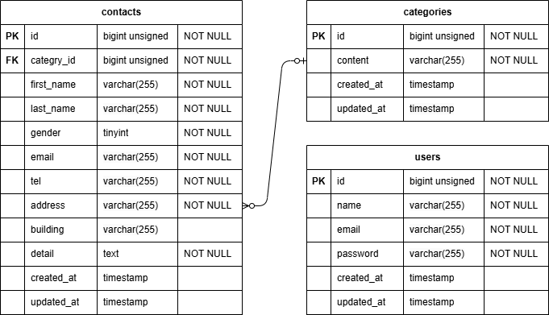

# アプリケーション名
    テストお問い合わせフォーム

## 環境構築
git@github.com:saori2702/test_contact-form.git
docker-compose up -d

docker-compose exec php bash
composer install
cp .env.example.env,環境変数を変更
php artisan migrate
php artisan db:seed

## 使用技術
- PHP 8.1
- Laravel 8 (Fortifyによる認証実装)
- mysql 8.0.26
- nginx 1.21.1
- Docker / Docker-compose

## URL
contact :http://localhost/
confirm :http://localhost/confirm
thanks :http://localhost/thanks
register :http://localhost/register
login :http://localhost/login
admin :http://localhost/admin
phpMyadmin :http://localhost:8080

## 機能一覧
- ユーザー登録・ログイン機能 (Laravel Fortify)
- お問い合わせ入力・確認・送信機能
- 管理者専用ページ (一覧表示・検索・削除)
- バリデーション機能
- 必須入力チェック、メールアドレス形式チェックなど

## ER図

